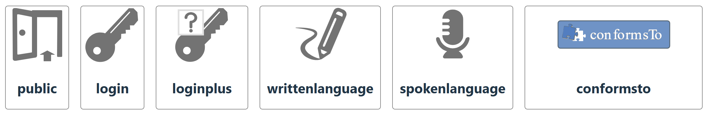
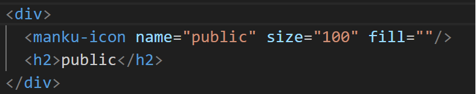

# icon-library
Icon library for use in LDaCA projects. Can be viewed [here](https://www.npmjs.com/package/manku-icon-lib).

# List of Current Icon Names
- public
- login
- loginplus
- writtenlanguage
- spokenlanguage
- signedlanguage
- conformsto
- binderlink

# How to Use
1. Ensure you have NPM installed
2. Navigate to your project root
3. Run `npm i manku-icon-lib`
4. Use the icons as you would any svg, controlling the size using the width and height attributes and the color with the fill attribute. 

# Using the Icon Library within a Vue Project
## You can view a [Vue Example](https://github.com/Language-Research-Technology/manku-icons/tree/main/Vue%20Example) for an example of Vue project implementation.
1. Navigate to the root of your Vue project
2. Install the [vite svg loader](https://www.npmjs.com/package/vite-svg-loader) `npm i vite-svg-loader` and follow the Setup process
3. Within your vue project, navigate to your assets folder
4. Install the icon library by running `npm i manku-icon-lib` in the terminal. 
5. Add an import statement at the top of your .vue file, `import { MankuIcon } from 'manku-icon-lib';`
6. Create a MankuIcon component with a `name` property that equals the icons filename and add properties `size` to control the size and `color` to control the color e.g. `<MankuIcon name="Login" size="200" color="blue"/>`. 

### Example
Vue Project Implementation

Vue Code



# Manipulating the icons within a Vue Project
- The styling of the icons can be changed either in a css class that can be applied to the Vue component or the styling can be directly applied to the vue component. 
- The color of an icon can be changed using `color: ;` e.g. `color: red;`
- By default an icons will fill it's container, the size of an icon can be changed by using `width: ;` and `height: ;` values, e.g. `width: 100px;`

# Adding an icon to the package
1. Clone the repository
2. Add icon to the repository `lib\assets\icons\`
3. Request to merge the new icon into the repository

# How to Update the Package
1. Navigate to the root directory
2. Increase the "version" in package.json
3. Add changes to git, commit, pull and push to main
4. Run `npm run build`
5. Run `npm publish`


## Example App

To use the example app
```
npm run build
cd example-app-using-manku
npm install
npm run dev
```
